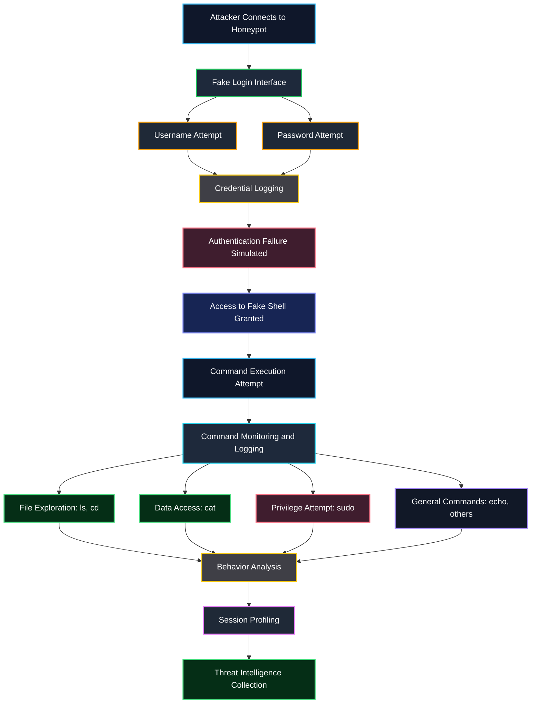

# Honeypot Threat Model

This document outlines the types of attacker behaviors, threat scenarios, and interaction patterns targeted by the interactive honeypot system.

---

## Threat Overview

The honeypot is designed to attract and observe unauthorized users attempting to:

- Gain system access
- Explore file structures
- Execute commands
- Escalate privileges
- Extract sensitive data

---

## Threat Interaction Flow

---

## Targeted Threat Behaviors

The honeypot captures and analyzes:

### Credential Attacks
- Brute-force login attempts  
- Weak password usage  
- Repeated authentication retries  

### Reconnaissance Activity
- Directory listing (`ls`)  
- Navigation (`cd`)  
- System exploration  

### Data Access Attempts
- Accessing sensitive files (`/etc/passwd`)  
- Reading private keys (`.ssh/id_rsa`)  
- Searching for valuable information  

### Command Execution Patterns
- Testing available commands  
- Checking system behavior  
- Identifying environment limitations  

### Privilege Escalation Attempts
- Use of `sudo`  
- Attempted elevation of access  

---

## Attacker Profiles

This honeypot is most effective against:

- Script kiddies  
- Automated scanning bots  
- Beginner attackers  
- Unauthorized internal users  

---

## 📊 Threat Model Summary

The honeypot does not prevent attacks — instead, it **intentionally attracts and observes malicious activity**.  

By simulating a realistic environment, it enables:

- Behavior tracking  
- Credential harvesting analysis  
- Command pattern monitoring  
- Threat intelligence generation  

This supports defensive cybersecurity strategies and real-world attack understanding.
